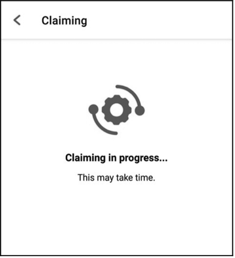
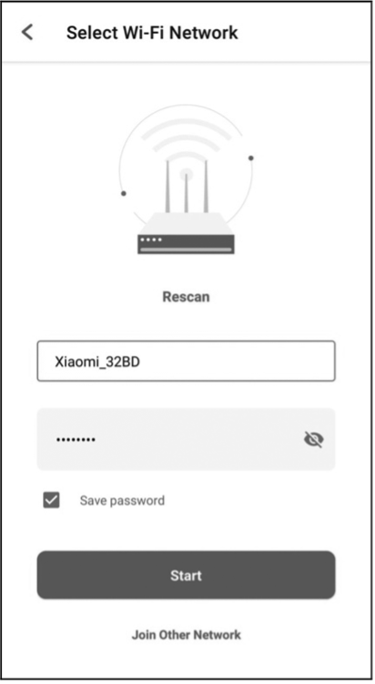
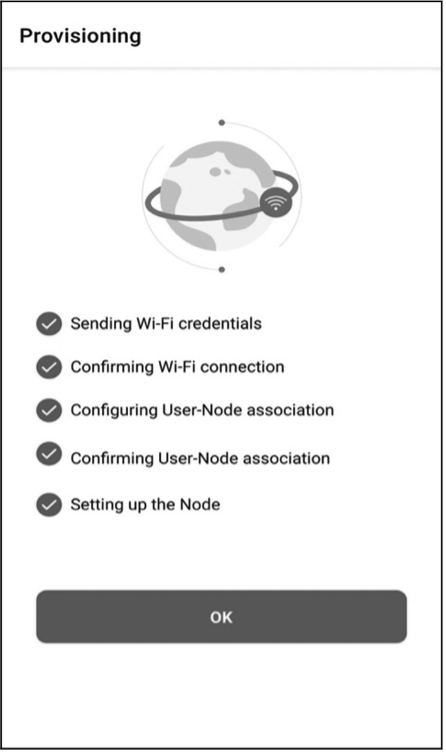

# Smart Light Example

The RainMaker SDK is built on top of ESP-IDF and provides simple APIs
for building applications based on the ESP RainMaker specification. This
section will explain and run the smart light example. The code is as
follows:

```c
esp_rmaker_device_t *light_device;
//Callback function to handle commands received from ESP RainMaker
static esp_err_t write_cb(const esp_rmaker_device_t *device,
                          constesp_rmaker_param_t *param,
                          const esp_rmaker_param_val_t val,
                          void *priv_data,
                          esp_rmaker_write_ctx_t *ctx)
{
    if (ctx) {
        ESP_LOGI(TAG,
                "Received write request via : %s",
                esp_rmaker_device_cb_src_to_str(ctx->src));
    }

    const char *device_name = esp_rmaker_device_get_name(device);
    const char *param_name = esp_rmaker_param_get_name(param);
    if (strcmp(param_name, ESP_RMAKER_DEF_POWER_NAME) == 0) {
        ESP_LOGI(TAG,
                "Received value = %s for %s - %s",
                val.val.b? "true" : "false",
                device_name,
                param_name);
        app_light_set_power(val.val.b);
    } else if (strcmp(param_name, ESP_RMAKER_DEF_BRIGHTNESS_NAME) == 0) {
        ESP_LOGI(TAG,
                "Received value = %d for %s - %s",
                val.val.i,
                device_name,
                param_name);
        app_light_set_brightness(val.val.i);
    } else if (strcmp(param_name, ESP_RMAKER_DEF_HUE_NAME) == 0) {
        ESP_LOGI(TAG,
                "Received value = %d for %s - %s",
                val.val.i, 
                device_name, 
                param_name);
        app_light_set_hue(val.val.i);
    } else if (strcmp(param_name, ESP_RMAKER_DEF_SATURATION_NAME) == 0) {
        ESP_LOGI(TAG, 
                "Received value = %d for %s - %s",
                val.val.i, 
                device_name, 
                param_name);
        app_light_set_saturation(val.val.i);
    } else {
        //Omit parameters that do not need processing
        return ESP_OK;
    }
    esp_rmaker_param_update_and_report(param, val);
    return ESP_OK;
}

void app_main()
{
    //Initialise the driver layer
    app_driver_init();

    //Initialise the NVS partition
    esp_err_t err = nvs_flash_init();
    if (err == ESP_ERR_NVS_NO_FREE_PAGES || err == ESP_ERR_NVS_NEW_VERSION_FOUND) {
        ESP_ERROR_CHECK(nvs_flash_erase());
        err = nvs_flash_init();
    }
    ESP_ERROR_CHECK( err );

    //Initialise Wi-Fi
    app_wifi_init();

    //Initialise ESP RainMaker Agent
    esp_rmaker_config_t rainmaker_cfg = {
        .enable_time_sync = false,
    };
    esp_rmaker_node_t *node = esp_rmaker_node_init(&rainmaker_cfg,
                                                  "ESP RainMakerDevice", 
                                                  "Lightbulb");
    if (!node) {
        ESP_LOGE(TAG, "Could not initialise node. Aborting!!!");
        vTaskDelay(5000/portTICK_PERIOD_MS);
        abort();
    }

    //Create the device and add parameters
    light_device = esp_rmaker_lightbulb_device_create("Light",
                                                     NULL,
                                                     DEFAULT_POWER);
    esp_rmaker_device_add_cb(light_device, write_cb, NULL);
    esp_rmaker_device_add_param(light_device,
                                esp_rmaker_brightness_param_create(  
                                ESP_RMAKER_DEF_BRIGHTNESS_NAME, 
                                DEFAULT_BRIGHTNESS));
    esp_rmaker_device_add_param(light_device, esp_rmaker_hue_param_creat(
                                ESP_RMAKER_DEF_HUE_NAME,  
                                DEFAULT_HUE));
    esp_rmaker_device_add_param(light_device, 
                                esp_rmaker_saturation_param_create( 
                                ESP_RMAKER_DEF_SATURATION_NAME, 
                                DEFAULT_SATURATION));
    esp_rmaker_node_add_device(node, light_device);

    //Enable OTA upgrade
    esp_rmaker_ota_config_t ota_config = {
        .server_cert = ota_server_cert,
    };
    esp_rmaker_ota_enable(&ota_config, OTA_USING_PARAMS);
    //Enable time & time zone service
    esp_rmaker_timezone_service_enable();

    //Enable scheduling service
    esp_rmaker_schedule_enable();

    //Enable ESP Insight
    app_insights_enable();

    //Enable ESP RainMaker Agent
    esp_rmaker_start();

    //Enable Wi-Fi
    err = app_wifi_start(POP_TYPE_RANDOM);
    if (err != ESP_OK) {
        ESP_LOGE(TAG, "Could not start Wifi. Aborting!!!");
        vTaskDelay(5000/portTICK_PERIOD_MS);
        abort();
    }
}
```

Firstly, the above example initialises the hardware driver by configuring GPIO and initialising peripherals. Next, the NVS partition is initialised in preparation for reading data from the flash. The partition table `partitions.csv` is as follows:

```
# Name,   Type, SubType, Offset,    Size,   Flags
# Note: Firmware partition offset needs to be 64K aligned, initial 36K (9 sectors) are reserved for bootloader and partition table
sec_cert, 0x3F, ,       0xd000,     0x3000, ,
nvs,      data, nvs,    0x10000,    0x6000,
otadata,  data, ota,    ,           0x2000
phy_init, data, phy,    ,           0x1000,
ota_0,    app,  ota_0,  0x20000,    1600K,
ota_1,    app,  ota_1,  ,           1600K,
fctry,    data, nvs,    0x340000,   0x6000
```

As shown in the above partition table, there are two NVS partitions in
this example project: `nvs` and `fctry`. The former is used to store
network configuration and local scheduling information and the latter is
used to store certificate information.

Then, Wi-Fi is initialised. This step must be performed before the
`esp_rmaker_node_init()` function is called. If the `fctry` partition does not contain a certificate, Assisted Claiming will be enabled because the MAC address can be used as the initial node ID when Wi-Fi is initialised. Afterward, the device model is created and the callback function is added. All cloud downlink data will be transmitted through this callback function, and the ESP RainMaker core task is started. Finally, Wi-Fi is enabled. If the device has not been connected to Wi-Fi, the provisioning application will be automatically started. The application is implemented using the `wifi_provisioning` component in ESP-IDF and started by calling `app_wifi_start()` in the ESP RainMaker SDK.

Run `idf.py` to compile and flash the `led_light` project and `idf.py monitor` to open the monitor, and then you will see the following log:

<pre><code>I (30) boot: ESP-IDF v4.3.2-dirty 2nd stage bootloader
...
...
...
I (488) cpu_start: Starting scheduler.
I (493) gpio: GPIO[9]| InputEn: 1| OutputEn: 0| OpenDrain: 0| Pullup: 1| Pulldown: 0| Intr:3
I (503) coexist: coexist rom version 9387209
I (503) pp: pp rom version: 9387209
I (503) net80211: net80211 rom version: 9387209
I (523) wifi:wifi driver task: 3fca4d8c, prio:23, stack:6656, core=0
I (523) system_api: Base MAC address is not set
I (523) system_api: read default base MAC address from EFUSE
...
...
...
I (623) esp_rmaker_work_queue: Work Queue created.
I (623) esp_claim: Initialising Assisted Claiming. This may take time.
W (633) esp_claim: Generating the private key. This may take time.
I (110533) esp_rmaker_node: Node ID ----- 7CDFA161BE38
I (21213) esp_rmaker_node: Node ID ----- 7CDFA1C21DA0
I (21213) esp_rmaker_ota: OTA state = 2
I (21213) esp_rmaker_ota_using_params: OTA enabled with Params
I (21223) esp_rmaker_time_service: Time service enabled
I (21223) esp_rmaker_time: Initializing SNTP. Using the SNTP server: pool.ntp.org
I (21233) app_insights: Enable CONFIG_ESP_INSIGHTS_ENABLED to get Insights.
I (21243) esp_rmaker_core: Starting RainMaker Work Queue task
I (21253) esp_rmaker_work_queue: RainMaker Work Queue task started.
I (21253) esp_claim: Waiting for assisted claim to finish.
...
...
...

I (21623) app_wifi: If QR code is not visible, copy paste the below URL in a browser.
https://rainmaker.espressif.com/qrcode.html?data={"ver":"v1","name":"PROV_8a20e0","pop":"827e49ae","transport":"ble"}
I (21633) app_wifi: Provisioning Started. Name : PROV_8a20e0, POP : 827e49ae</code></pre>

Use the smartphone app to scan the QR code. If no certificate is present
in the `fctry` partition, Assisted Claiming will be enabled, as shown in
Figure 9.11.

<figure align="center">
    
    <figcaption>Figure 9.11. Interface for enabling Assisted Claiming</figcaption>
</figure>

```console
...
...
I (444493) esp_claim: Assisted Claiming Started.
I (447603) esp_rmaker_core: New Node ID ----- nq8xT6p53BZHTm6k8AZqN
I (472813) esp_claim: Assisted Claiming was Successful.
```

After the certificate is obtained, the device enters the network
configuration phase. The smartphone app will send the selected SSID and
password to the device, which will then attempt to connect to the router
and the cloud, as shown in Figure 9.12.

<figure align="center">
    
    <figcaption>Figure 9.12. Device connecting to router and cloud</figcaption>
</figure>

```console
...
...
I (491113) esp_rmaker_user_mapping: Received request for node details
I (491113) esp_rmaker_user_mapping: Got user_id = 764865be-e49f-49d1-afa1-696d6a7e3233, secret_key = a3c89473-514f-4aa4-a190-a9aa38e7a9d8
I (491123) esp_rmaker_user_mapping: Sending status SUCCESS
I (491753) app_wifi: Received Wi-Fi credentials
        SSID     : Xiaomi_32BD
        Password : 12345678
I (495173) wifi:new:<11,0>, old:<1,0>, ap:<255,255>, sta:<11,0>, prof:1
I (495753) wifi:state: init -> auth (b0)
I (495793) wifi:state: auth -> assoc (0)
I (495833) wifi:state: assoc -> run (10)
I (495973) wifi:connected with Xiaomi_32BD, aid = 2, channel 11, BW20, bssid = 88:c3:97:9e:32:be
I (495973) wifi:security: WPA2-PSK, phy: bgn, rssi: -25
I (495983) wifi:pm start, type: 1
I (495983) wifi:set rx beacon pti, rx_bcn_pti: 14, bcn_timeout: 14, mt_pti: 25000, mt_time: 10000
I (496043) wifi:BcnInt:102400, DTIM:1
W (496573) wifi:<ba-add>idx:0 (ifx:0, 88:c3:97:9e:32:be), tid:0, ssn:2, winSize:64
I (497503) app_wifi: Connected with IP Address:192.168.31.65
I (497503) esp_netif_handlers: sta ip: 192.168.31.65, mask: 255.255.255.0, gw: 192.168.31.1
I (497503) wifi_prov_mgr: STA Got IP
I (497503) app_wifi: Provisioning successful
I (497513) esp_mqtt_glue: Initialising MQTT
I (500973) esp_mqtt_glue: MQTT Connected
```

After completing the configuration and successfully connecting to the
cloud, the device will send a user-node association message, and the app
will continue to check the association status, as shown in Figure 9.13.

<figure align="center">
    
    <figcaption>Figure 9.13. Checking association status</figcaption>
</figure>

```
I (45959) esp_rmaker_user_mapping: User Node association message published successfully.
```

After the association, you can check this node using CLI.
