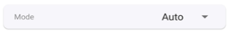

# RainMaker App and Third-Party Integrations

In Section 9.4.6, we have completed the device provisioning and
user-node mapping, enabling control of a smart light through the app. As
a result, the smart light icon and UI interface are now displayed on the
app's homepage. The standard parameters, devices, and UIs mentioned
earlier are defined by ESP RainMaker and form the basis of its standard
framework. By using this framework, the app can accurately manage each
device's parameters and supported services. These standard items, which
are listed in the tables below, are also applicable to third-party
platforms.

## Standard UI device types

<i>Table 9.5. Standard UI device types</i>

|Name|Type|Params|GVA|Alexa|Image|
|----|----|------|---|-----|:---:|
|Switch|esp.device.switch|Name, Power*|SWITCH|SWITCH||
|Lightbulb|esp.device.lightbulb|Name, Power*, Brightness, Color Temperature, Hue, Saturation, Intensity|LIGHT|LIGHT||
|Light|esp.device.light|Name, Power*, Brightness, Color Temperature, Hue, Saturation, Intensity|LIGHT|LIGHT|&ndash;|
|Fan|esp.device.fan|Name, Power*, Speed, Direction|FAN|FAN||
|Temperature Sensor|esp.device.temperature-sensor|Name, Temperature*|&ndash;|TEMPERATURE_SENSOR||
|Outlet|esp.device.outlet|Name, Power|OUTLET|SMARTPLUG||
|Plug|esp.device.plug|Name, Power|OUTLET|SMARTPLUG|&ndash;|
|Socket|esp.device.socket|Name, Power|OUTLET|SMARTPLUG|&ndash;|
|Lock|esp.device.lock|Name, Lock State|LOCK|SMARTLOCK||
|Internal Blinds|esp.device.blinds-internal|Name|BLINDS|INTERIOR_BLIND|&ndash;|
|External Blinds|esp.device.blinds-externa|Name|BLINDS|EXTERIOR_BLIND|&ndash;|
|Garage Door|esp.device.garage-door|Name|GARAGE|GARAGE_DOOR|&ndash;|
|Garage Lock|esp.device.garage-door-lock|Name|GARAGE|SMARTLOCK|&ndash;|
|Speaker|esp.device.speaker|Name|SPEAKER|SPEAKER|&ndash;|
|Air Conditioner|esp.device.air-conditioner|Name|AC_UNIT|AIR_CONDITIONER|&ndash;|
|Thermostat|esp.device.thermostat|Name|THERMOSTAT|THERMOSTAT||
|TV|esp.device.tv|Name|TV|TV|&ndash;|
|Washer|esp.device.washer|Name|WASHER|WASHER|&ndash;|
|Other|esp.device.other|&ndash;|&ndash;|OTHER||

## Standard UI types

The standard UI type added to a parameter is displayed as the corresponding UI shown in Table 9.6 in the ESP RainMaker app.

<i>Table 9.6. Standard UI types</i>

|Name|Type|Data Types|Requirements|Sample|
|----|----|----------|------------|:----:|
|Text (Default)|esp.ui.text|All|N/A||
|Toggle Switch|esp.ui.toggle|bool|N/A||
|Slider|esp.ui.slider|int, float|Bounds (min, max)||
|Brightness Slider|esp.ui.slider|int|Param type = esp.param.brightness||
|CCT Slider|esp.ui.slider|int|Param type = esp.param.cct||
|Saturation Slider|esp.ui.slider|int|Param type = esp.param.saturation||
|Hue Slider|esp.ui.hue-slider|int|Param type = esp.param.hue||
|Hue Circle|esp.ui.hue-circle|int|Param type = esp.param.hue||
|
Push button (Big)
|esp.ui.push-btn-big|bool|N/A||
|Dropdown|esp.ui.dropdown|int/string|Bounds (min/max) for IntValid strs for String||
|Trigger (Android only)|esp.ui.trigger|bool|N/A||
|Hidden (Android only)|esp.ui.hidden|bool|N/A|
Param will be hidden
|

## Standard parameter types

They are mapped to the parameters of corresponding names and UIs in the Alexa and Google Home apps.

<i>Table 9.7. Standard parameter types</i>

<table><thead>
    <tr>
        <th>Name</th><th>Type</th><th>Data Types</th><th>UI Type</th><th>Properties</th><th>Min, Max, Step</th>
    </tr>
</thead><tbody>
    <tr>
        <td>Power</td><td>esp.param.power</td><td>bool</td><td>esp.ui.toggle</td><td>Read, Write</td><td>N/A</td></tr>
    <tr>
        <td>Brightness</td><td>esp.param.brightness</td><td>int</td><td>esp.ui.slider</td><td>Read, Write</td><td>0, 100, 1</td>
    </tr>
    <tr>
        <td>CCT</td><td>esp.param.cct</td><td>int</td><td>esp.ui.slider</td><td>Read, Write</td><td>
2700, 6500, 100
</td>
    </tr>
    <tr>
        <td>Hue</td><td>esp.param.hue</td><td>int</td><td>esp.ui.slider</td><td>Read, Write</td><td>0, 360, 1</td>
    </tr>
    <tr>
        <td>Saturation</td><td>esp.param.saturation</td><td>int</td><td>esp.ui.slider</td><td>Read, Write</td><td>0, 100, 1</td>
    </tr>
    <tr>
        <td>Intensity</td><td>esp.param.intensity</td><td>int</td><td>esp.ui.slider</td><td>Read, Write</td><td>0, 100, 1</td>
    </tr>
    <tr>
        <td>Speed</td><td>esp.param.speed</td><td>int</td><td>esp.ui.slider</td><td>Read, Write</td><td>0, 5, 1</td>
    </tr>
    <tr>
        <td>Direction</td><td>esp.param.direction</td><td>int</td><td>esp.ui.dropdown</td><td>Read, Write</td><td>0, 1, 1</td>
    </tr>
    <tr>
        <td>Temperature</td><td>esp.param.temperature</td><td>float</td><td>N/A</td><td>Read</td><td>N/A</td>
    </tr>
    <tr>
        <td>OTA URL</td><td>esp.param.ota_url</td><td>string</td><td>N/A</td><td>Write</td><td>N/A</td>
    </tr>
    <tr>
        <td>OTA Status</td><td>esp.param.ota_status</td><td>string</td><td>N/A</td><td>Read</td><td>N/A</td>
    </tr>
    <tr>
        <td>OTA Info</td><td>esp.param.ota_info</td><td>string</td><td>N/A</td><td>Read</td><td>N/A</td>
    </tr>
    <tr>
        <td>Timezone</td><td>esp.param.tz</td><td>string</td><td>N/A</td><td>Read, Write</td><td>N/A</td>
    </tr>
	<tr>
		<td>Timezone POSIX</td><td>esp.param.tz_posix</td><td>string</td><td>N/A</td><td>Read, Write</td><td>N/A</td>
	</tr>
	<tr>
		<td>Schedules</td><td>esp.param.schedules</td><td>array</td><td>N/A</td><td>
Read, Write, Persist
</td><td>N/A</td>
	</tr>
	<tr>
		<td>Reboot</td><td>esp.param.reboot</td><td>bool</td><td>N/A</td><td>Read, Write</td><td>N/A</td>
	</tr>
	<tr>
		<td>Factory-Reset</td><td>esp.param.factory-reset</td><td>bool</td><td>N/A</td><td>Read, Write</td><td>N/A</td>
	</tr>
	<tr>
		<td>Wi-Fi-Reset</td><td>esp.param.wifi-reset</td><td>bool</td><td>N/A</td><td>Read, Write</td><td>N/A</td>
	</tr>
	<tr>
		<td>Toggle Controller</td><td>esp.param.toggle</td><td>bool</td><td>Any type applicable</td><td>Read, Write</td><td>N/A</td>
	</tr>
	<tr>
		<td>Range Controller</td><td>esp.param.range</td><td>int/float</td><td>Any type applicable</td><td>Read, Write</td><td>App Specific</td>
	</tr>
	<tr>
		<td>Mode Controller</td><td>esp.param.mode</td><td>string</td><td>esp.ui.dropdown</td><td>Read, Write</td><td>N/A</td>
	</tr>
	<tr>
		<td>Setpoint Temperature</td><td>esp.param.setpoint-temperature</td><td>int/float</td><td>Any type applicable</td><td>Read/Write</td><td>N/A</td>
	</tr>
	<tr>
		<td>Lock State</td><td>esp.param.lockstate</td><td>bool</td><td>Any type applicable</td><td>Read/Write</td><td>N/A</td>
	</tr>
	<tr>
		<td>Blinds Position</td><td>esp.param.blinds-position</td><td>int</td><td>esp.ui.slider</td><td>Read/Write</td><td>0, 100, 1</td>
	</tr>
	<tr>
		<td>Garage Position</td><td>esp.param.garage-position</td><td>int</td><td>esp.ui.slider</td><td>Read/Write</td><td>0, 100, 1</td>
	</tr>
	<tr>
		<td rowspan="4">Light Mode</td><td rowspan="4">esp.param.light-mode</td><td rowspan="4">int</td><td rowspan="4">esp.ui.dropdown/ esp.ui.hidden</td><td rowspan="4">Read/Write</td><td>0, 2, 1</td>
	</tr>
	<tr><td>0:invalid</td></tr>
	<tr><td>1:HSV</td></tr>
	<tr><td>2:CCT</td></tr>
	<tr>
		<td>AC Mode</td><td>esp.paran.ac-mode</td><td>string</td><td>esp.ui.dropdown</td><td>Read/Write</td><td>N/A</td>
    </tr>
</tbody></table>

## Standard service types

They are only used to quickly create services in the ESP RainMaker SDK.

<i>Table 9.8. Standard service types</i>

|Name|Type|Params|
|----|----|------|
|OTA|esp.service.ota|OTA URL, OTA Status, OTA Info|
|Schedule|esp.service.schedules|Schedules|
|Time|esp.service.time|TZ, TZ-POSIX|
|System|esp.service.system|Reboot, Factory-Reset, Wi-Fi-Reset|

On the Skill page of Alexa or the Google Service Compatibility page of
Google Home, sync your ESP RainMaker devices. Link to your ESP RainMaker
account. Then, you can use the two apps to control the devices and use
voice commands to operate them.

Figure 9.14 displays the ESP RainMaker devices in Alexa. They can be
controlled using voice commands such as "Alexa, please turn on the
light".

> 📌 **NOTE**
>
> Learn more about Alexa Skill at <https://www.amazon.com/Espressif-Systems-ESP-RainMaker/dp/B0881W7RPV/>.

<figure align="center">
    
    
    <figcaption>Figure 9.14.ESP RainMaker devices in Alexa</figcaption>
</figure>

Figure 9.15 displays the ESP RainMaker devices in the Google Home. They
can be controlled using voice commands such as "Hey Google, please turn
off the light".

<figure align="center">
    
    
    <figcaption>Figure 9.15.ESP RainMaker devices in Google Home</figcaption>
</figure>

ESP RainMaker builds an intermediate layer in the cloud backend. This
layer maps the standard parameter types and device types that are built
into firmware to the formats that Alexa Skill and Google Assistant can
understand. Therefore, device types in ESP RainMaker, such as smart
lights and switches, are mapped to similar device types in Alexa Skill
and Google Assistant, and their parameters, such as switch, brightness,
and color, are mapped to corresponding capabilities and traits. If you
only set brightness, you will get a smart light with adjustable
brightness in Alexa and Google Home. If you also include color and CCT,
you can adjust its color and color temperature.
