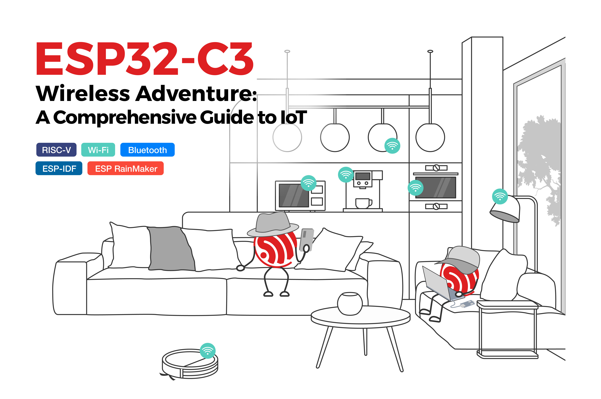

# Introduction

**ESP32-C3** is a single-core Wi-Fi and Bluetooth 5 (LE) microcontroller SoC, based on the open-source RISC-V architecture. It strikes the right balance of power, I/O capabilities, and security, thus offering the optimal cost-effective solution for connected devices. To show various applications of the ESP32-C3 family, this book by Espressif will take you on an interesting journey through AIoT, starting from the basics of IoT project development and environment setup to practical examples. The first four chapters talk about IoT, ESP RainMaker and ESP-IDF. Chapter 5 and 6 brief on hardware design and driver development. As you progress, you’ll discover how to configure your project through Wi-Fi networks and mobile Apps. Finally, you’ll learn to optimize your project and put it into mass production.

If you are an engineer in related fields, a software architect, a teacher, a student, or anyone who has an interest in IoT, this book is for you.

You may download the code example used in this book from Espressif’s site on GitHub. For latest information on IoT development, please follow our official account.

